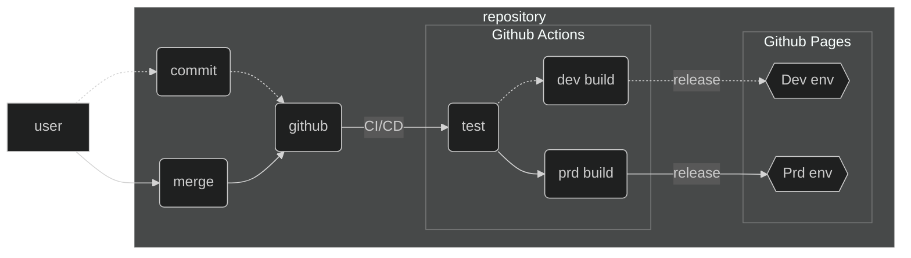

# my_pages
自分用のページ

# CI/CD概要

```mermaid
---
config:
    theme: dark
---
graph LR;
    User["user"]
    Commit("commit")
    Merge("merge")
    Github("github")
    Test("test")

    DevBuild("dev build")
    PrdBuild("prd build")

    DevEnv{{"Dev env"}}
    PrdEnv{{"Prd env"}}

    User -.-> Commit
    User --> Merge

    subgraph repository 
    direction LR
        Commit -.-> Github
        Github -->|CI/CD| Test

        subgraph Github Actions
            Test -.-> DevBuild
            Test --> PrdBuild
        end

        Merge --> Github

        DevBuild -.->|release| DevEnv
        PrdBuild -->|release| PrdEnv

        subgraph Github Pages
            DevEnv
            PrdEnv
        end
    end
```
PR作成を行うとCIが実行され、testとDev環境へのリリースが完了
mergeするとPrd環境へのリリースが完了

# Page設定
github pagesにおいて、`gh-pages`ブランチの`docs/`を参照するように設定する
